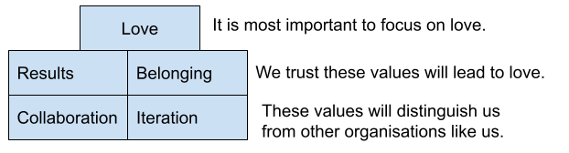

# Values hierarchy

Occasionally, values can contradict each other. For instance, transparency would dictate we publish all security vulnerabilities the moment they are found, but this would jeopardise our students. It's useful to keep in mind this hierarchy to resolve confusion about what to do in a specific circumstance, while remaining consistent with our core values.

Think of the hierarchy as a weighting system. Values higher in the hierarchy do not automatically override values lower in the hierarchy. Here are some examples:

If a change impacts Love positively but impacts Collaboration negatively in roughly the same amount, we would move ahead since Love is higher in the hierarchy than Collaboration.

If a change has a massive positive impact on Iteration but negatively impacts Results, we would move ahead even though Iteration is lower in the hierarchy than Results because the overall impact is more positive than negative.

It's an attempt to relieve at least some of the tension. It's not absolute. If you think of values as binary, that's not going to work. There will always be interpretation, and there's always magnitude to consider.

We made a hierarchy so that it's clear, in the end, love, in all its complexity, matters most. For instance, we're not going to be collaborative for the sake of being collaborative. We're not radical in our collaboration. We do it because we think it will lead to better outcomes in showing love to the team and the community.

Those hierarchies are really important. They won't preempt every debate, but it helps.

